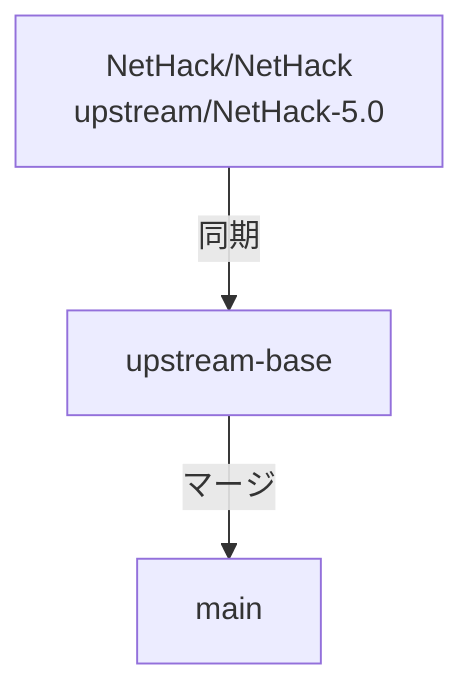

<!-- Modified by NetHackJP contributor @satokiyon; latest change date: 2026-09-02. -->
<!--
  IMPORTANT POLICY FOR NetHackJP-ONLY MODIFICATIONS
  =================================================
  When adding changes to src/ or include/ that are *not* present in
  upstream NetHack (NetHack/NetHack @ NetHack-5.0), follow these rules:

  1. Mark all such custom code regions with a /* NetHackJP: ... */ comment
     in the source file itself, so future readers can quickly identify
     NetHackJP-specific code vs. upstream code.

  2. Add a dedicated subsection below (§4.x) that documents:
     - the marker tag used in the source,
     - which file(s) and roughly which lines contain the custom code,
     - how to "remove" the customization (so we can drop the change
       cleanly if upstream eventually adds an equivalent feature), and
     - how to follow upstream if upstream adds the same or a similar
       change later.

  3. Priority rule: when upstream introduces a change that overlaps with
     a NetHackJP-only customization, the upstream version takes
     precedence — we drop the NetHackJP code and follow upstream.
     Upstream compatibility is the primary goal; NetHackJP-specific
     behavior is secondary.

  This policy is enforced for every commit that touches shared
  upstream files (src/, include/).  Local changes that live entirely
  under sys/ (e.g. win/flutter, sys/android) are exempt because they
  are not part of upstream NetHack.
-->
# NetHackJP 開発メモ

本ドキュメントは、Windows ポート（CUI/GUI）の日本語化リポジトリである `NetHackJP` の開発環境の構築、ビルド、マージ運用およびリリース手順についてまとめたものです。

---

## 1. 開発環境の要件（事前準備）

ビルドを実行する前に、以下のソフトウェアを Windows 環境にインストールし、セットアップを完了させてください。

- **Visual Studio** (MSVC)
  - インストール時に「C++ によるデスクトップ開発」ワークロードを選択してください。
- **CMake**
  - ビルド設定の生成に必要です。インストール時にシステム PATH へ追加するオプションを選択するか、手動で PATH を通してください。
- **Git for Windows**

### Linux / WSL (Windows Subsystem for Linux) 環境の事前準備
Linux (Ubuntu / Debian 等) 上でビルドを行う場合は、事前に以下のパッケージをインストールしてください。
```bash
sudo apt update
sudo apt install build-essential libncursesw5-dev liblua5.4-dev pkg-config gdb libx11-dev libxft-dev libxpm-dev libxaw7-dev libxt-dev
```

| パッケージ | 用途 |
|---|---|
| `build-essential` | gcc / make 等のビルドツール一式 |
| `libncursesw5-dev` | curses (UTF-8 対応) ターミナル UI ライブラリ |
| `liblua5.4-dev` | Lua 5.4 組み込みスクリプトエンジン |
| `pkg-config` | ライブラリのコンパイルフラグ解決 |
| `gdb` | パニックトレース (`PANICTRACE_GDB`) によるクラッシュ解析。実行時に必要 |
| `libx11-dev` / `libxft-dev` / `libxaw7-dev` 等 | X11 GUI ポート (UTF-8 Xft / Athena Widgets) のビルド・描画ライブラリ |
| `fonts-noto-cjk` (`Noto Sans CJK JP`) | X11 GUI ポートで日本語・墓石死因の文字化けを防ぐ日本語 CJK フォントパッケージ |

> [!NOTE]
> `gdb` は **実行時**にも参照されます。`sysconf` の `PANICTRACE_GDB=1` が有効な状態で `gdb` が存在しない場合、クラッシュ時に追加のバックトレース情報が取れないだけでなく、起動に失敗するケースもあります。インストールしておくことを強く推奨します。

*GUI ポート（X11 や Qt）のコンパイルを行う場合は、上記パッケージを事前導入してください。*

---

## 2. ビルドの実行

### 2.1. Windows ポートの開発・ビルド (MSVC)
リポジトリに用意されている開発者用のバッチファイルを実行することで、ビルドとテストを安全に行うことができます。
- **実行スクリプト**: `sys/windows/vs/build_one.bat`
- このスクリプトは、MSVCのビルド環境（`Release|x64`）を自動セットアップした上で一貫したビルドを行います。

### 2.2. Linux / WSL ポートの開発・ビルド (GNU Make / GCC)
WSL または Linux 環境上で、ワンステップ用ビルドスクリプトを実行して Makefile の生成とビルドを一括で行うことができます。
- **実行スクリプト**: `sh sys/unix/build_wsl.sh`
- スクリプト実行により、日本語対応ヒントファイル `sys/unix/hints/linux-jp` が使用され、`src/nethack` に `tty` および `curses`（`ncursesw` による UTF-8 日本語表示対応）の両インターフェースに対応した実行ファイルが生成されます。
- *手動でステップを実行する場合*:
  ```bash
  sh sys/unix/setup.sh sys/unix/hints/linux-jp
  make -j$(nproc) WANT_WIN_CURSES=1 WANT_WIN_TTY=1 WANT_DEFAULT=tty all
  ```

#### 2.2.1. インストール（`make install`）— 必須

ビルド完了後、**必ず `make install` を実行してください**。
`src/nethack` を直接実行しても、起動直後に下記のようなエラーが発生して終了します。

```
/mnt/c/Users/satok/NetHackJP/playground: No such file or directory
Cannot chdir to /mnt/c/Users/satok/NetHackJP/playground.
```

これは `nethack` 実行ファイルが起動時に `HACKDIR`（= `playground/`）へ `chdir()` しようとするためです。
`playground/` ディレクトリとその中身は `make install` によって初めて作成されます。

```bash
make install
```

`make install` が行う主な処理：

| 処理 | 内容 |
|---|---|
| `mkdir -p playground/` | HACKDIR（ゲーム実行ディレクトリ）を作成 |
| `mkdir -p playground/save` | セーブファイル格納ディレクトリを作成 |
| `cp src/nethack playground/` | 実行ファイルをコピー |
| `cp dat/nhdat playground/` | 日本語データリソース（DLB）をコピー |
| `cp sys/unix/sysconf playground/` | システム設定ファイルをコピー |
| `touch playground/record` 等 | ハイスコア・ログ・ライブログファイルを新規作成 |

#### 2.2.2. 実行とウィンドウポート（`windowtype`）設定

`make install` が完了したら、`playground/nethack` を起動します。

```bash
playground/nethack
```

PATH に追加して短縮することも可能です。

```bash
export PATH="$PATH:$(pwd)/playground"
nethack
```

##### `windowtype` オプション設定（.nethackrc）
`build_wsl.sh` でビルドされたバイナリは `tty` と `curses` の両ウィンドウポートに対応しています。
ホームディレクトリ（`~/.nethackrc`）またはカレントディレクトリの `.nethackrc` にて `windowtype` を設定することで画面表示を切り替えることができます。

- **curses インターフェース（推奨）**:
  ```text
  OPTIONS=windowtype:curses,align_message:top,align_status:right
  ```
- **X11 GUI インターフェース**:
  ```text
  OPTIONS=windowtype:X11
  ```
  *(またはコマンドライン引数 `playground/nethack -wX11 -bg black -fg white -bd white` やリリースパッケージに同封されている `./nethackW` スクリプトで起動。リポジトリ直下のサンプル設定ファイル `.nethackrc.X11` を `~/.nethackrc` としてコピーして利用可能です。なお X11版のタイルセットはファイル名が `x11tiles` 固定であり、タイルの画像サイズは自動判定されます)*
- **tty インターフェース（デフォルト）**:
  ```text
  OPTIONS=windowtype:tty
  ```

> [!NOTE]
> `hints/linux-jp` 内で `WANT_WIN_X11 = 1` および `HAVE_NCURSESW = 1` が定義されているため、生成されるバイナリは `tty`, `curses`, `X11` の 3 ポートマルチウィンドウに対応します。`X11` 使用時には Xft による日本語 TrueType/OpenType フォント描画および XIM ロケール入力（`XtSetLanguageProc`）により、GUI 上で UTF-8 日本語表示・入力が正常に行われます。

#### 2.2.3. まとめ（WSL での初回セットアップ全体フロー）

```bash
# (1) 依存パッケージのインストール（初回のみ）
sudo apt update
sudo apt install -y build-essential libncursesw5-dev liblua5.4-dev pkg-config gdb

# (2) リポジトリのクローン（初回のみ）
# git clone https://github.com/satokiyon/NetHackJP.git
# cd NetHackJP

# (3) ビルド（tty & curses 両対応バイナリの生成）
sh sys/unix/build_wsl.sh

# (4) インストール（playground/ を構築）
make install

# (5) 起動
playground/nethack
```

> [!TIP]
> 再ビルド後も毎回 `make install` の実行が必要です。
> `make all && make install` とまとめると便利です。


---

## 3. 翻訳方針と補足情報

### 日本語助詞とモノ名の連結問題
* `You_feel` / `You_hear` / `You_see` は接頭辞を自動付与するため、呼び出し側リテラルで主語重複や助詞衝突を起こさないようにします。
* `%s` の直後に助詞（`は/を/に/へ/が/の/と/から`）が来る文では、`mon_nam()` / `Monnam()` より `l_monnam()` の利用を優先します。
* `%s%sから` のような複合テンプレートは機械置換せず、文脈ごとに語順を手動で整えます。
* 英語冠詞を返す補助（`just_an()` など）の結果は、日本語文へ直接連結しません。
* `%s`, `%d`, `%ld`, `%c` などのフォーマット指定子は、個数・順序・型を変更しません。
* 原則として文字列リテラルのみを変更し、ゲームロジックや条件分岐の意味は変えません。
* `隠し%s` のようなテンプレートは、展開後の最終語形 (`隠し扉`, `隠し通路`) が自然か確認します。

### コーディング規約とビルド対応
* **MSVC警告対応**: MSVC (Visual Studio) でのビルド時に `warning C4210` (関数内のextern宣言) などの警告が出ないよう、宣言は原則としてファイルスコープで行います。
* **日本語対応関数の命名**: 日本語化に関連する独自の補助関数には `jp_` 接頭辞（例: `jp_insight_has_nonascii`）を付与し、既存コードとの区別を明確にします。

### 再発防止と品質管理
翻訳やコード修正を行う際は、以下の点に注意して問題の発生を未然に防ぎます。

* **コミット前のビルド確認**: 変更を加えた後は、必ず `sys\windows\vs\build_one.bat` を実行してビルドが通ることを確認してください。構文エラーや未使用変数の警告などはこの段階で排除します。
* **構文と括弧の整合性**: 大規模な翻訳やリファクタリングを行った後は、中括弧 `{}` や括弧 `()` の対応が崩れていないか細心の注意を払ってください。
* **内部ロジックの再確認**: 死因 (`killer`) や中断理由 (`multi_reason`) などの内部キーとしても機能する文字列を翻訳した場合は、それらを参照している他の箇所（`topten.c` や `end.c` など）のロジックが壊れていないか、広範囲に調査して整合性を保ってください。
* **文字コードと文字化けの防止**: ソースファイルは UTF-8 で保存し、マルチバイト文字が不自然に分割されたり、特殊な制御文字が混入したりしないように注意してください。
* **未使用コードの整理**: 翻訳によって不要になった変数（英語メッセージ用の `message` や `verb` など）は、放置せずに削除してコンパイラの警告を最小限に抑えてください。

### 実施済みの翻訳改善・検証実績
* **`dat/tribute_jp` 内の冗長な「だった」表現および不自然な日本語訳の全面刷新（2026年8月完了）**:
  - `dat/tribute_jp` に存在していた、過去の機械翻訳に起因する「〜のだった」「〜だったのだった」といった冗長な文末表現を徹底して排除し、自然な日本語の過去形表現（例: 「判断した」「確信を持っていた」等）に修正しました。
  - 英語の指示代名詞（`it`, `this`, `he` など）が機械翻訳によって「色」「色彩」と直訳されていた箇所の誤訳を元の文脈（「これ」「彼」など）に修復しました。
  - カタカナ表記の「アンド」を「そして」「また」「〜と」などの自然な日本語表現に置き換えました。
  - マッピングズレ（アライメントの崩れ）を完全に同期・修復し、英語原本 `dat/tribute` の各パッセージと1対1で対応する状態（Offset 0）を最終パッセージ（ID 561）まで完全に維持しました。

  #### 品質維持・検証プロセス:
  1. **表示幅（75文字以内）と制御行の自動検証 (`validate_tribute.js`)**:
     - 編集時、およびコミット前には必ず自動検証スクリプトを実行し、以下の項目を検証して整合性を確保します：
       - **表示幅の厳守**: 各行の表示幅（全角2, 半角1）が 75 表示幅を超過していないこと。
       - **制御行の完全一致**: 全 561 パッセージおよび 2,249 行の制御行（`%section`, `%title`, `%passage`, `%e` 等）のシーケンスが原本と完全一致していること。
  2. **データビルドツールによる最終実地検証**:
     - `cmd /c "cd dat && ..\tools\Release\x64\makedefs.exe --make d"` を実行し、データ変換エラーが 0 件で正常コンパイルされることを確認します。


---

## 4. 独自拡張機能とアップストリーム同期

NetHackJP では、本家（アップストリーム）で未実装ながら利便性の高い機能を独自に実装している場合があります。これらは将来的にアップストリームで同様の修正が入った際、混乱を避けるために一括削除または差し替えが容易な構成にしています。

### 1. セーブデータ選択時の属性自動復元機能
ゲーム開始時のセーブデータ一覧からキャラクターを選択した際、職業・種族・性別・属性およびプレイモードを自動的に復元する機能です。
* **マーカータグ**: `/* NetHackJP: save data restoration */`
* **対象ファイルと削除手順**:
  1. **`include/extern.h`**: `select_saved_game` のプロトタイプ宣言を削除。
  2. **`src/role.c`**: `select_saved_game` 関数の実装全体を削除。
  3. **`src/restore.c`**: `restore_menu()` 関数内の `select_saved_game` の呼び出し箇所を削除。

### 2. セーブデータ一覧の重複表示バグの修正（Windows）
Windows版において、複数のセーブファイルが存在する際に一覧画面で同じキャラクターが重複して表示されてしまうバグの修正です。
* **マーカータグ**: `/* NetHackJP: update buffer for each file */`
* **対象ファイルと削除手順**:
  1. **`src/files.c`**: `get_saved_games()` 関数内の `foundfile_buffer()` の呼び出し箇所をアップストリームに合わせて差し戻し。

### 3. ハイスコアレコードの UTF-8 文字数ベースの切り詰め対応
プレイヤー名に日本語 (UTF-8) を含む場合に、ハイスコアレコード (record ファイル) 内で 10 バイトで丸ごと切られてしまう問題を修正し、UTF-8 文字数ベースで 10 文字まで保持できるようにした独自拡張です。
* **マーカータグ**: `/* NetHackJP: UTF-8 char truncation for topten name */`
* **背景**:
  - 従来は `src/topten.c` の `NAMSZ = 10` (バイト単位) で `copynchars(t0->name, svp.plname, NAMSZ)` により切り詰めていたため、日本語名は 3〜4 文字程度で切られていた。
  - これを `NAMSZ = 40` バイト + `NAMSZ_CHARS = 10` 文字の二段構えにし、`utf8_char_truncate()` で文字境界を保護しながら切り詰めるようにした。
  - ついでに、レビューで指摘された `readentry` での `t1` バッファの未初期化バイトが `strncmp` 比較に悪影響を及ぼす問題、および `SCANBUFSZ` にはヘッダー領域が算入されておらず行末が `fgets` で欠落し得る問題も併せて修正している。
* **対象ファイル**:
  - **`src/hacklib.c`**: `utf8_char_truncation_point()` / `utf8_char_truncate()` を新規追加。
  - **`include/hacklib.h`**: 上記 2 関数の `extern` 宣言を追加。
  - **`src/topten.c`**:
    - `NAMSZ` を `10` → `40` に拡大し、`NAMSZ_CHARS = 10` を新設。
    - 名前保存を `copynchars(NAMSZ)` + `utf8_char_truncate(NAMSZ_CHARS)` に変更。
    - `readentry()` の両分岐 (旧 `fmt32` / 現行 `fmt33`) で読み込み後に `utf8_char_truncate()` を適用。
    - `topten()` / `prscore()` で `newttentry()` 直後に `*t1 = zerott;` を追加 (4 箇所)。
    - `outentry()` の表示用フォーマットを `%.10s` → `%.*s` (NAMSZ) に変更。
    - `SCANBUFSZ` の算出式に `TT_HDR_MAX = 80` を加算。
* **アップストリーム追従手順**:
  1. アップストリーム (`upstream/NetHack-5.0`) で本件と同等の修正が入ったか確認する (例: `NAMSZ` 拡大、`SCANBUFSZ` のヘッダー領域算入、`strncmp` 対象のバッファゼロ化、UTF-8 文字数での切り詰めなど)。
  2. アップストリームに修正がある場合は、本独自拡張 (上記マーカータグで囲まれた変更) を取り消してアップストリームの実装に追従する。
  3. アップストリームに部分的な修正しかない場合は、重複する変更 (例: 既にアップストリームが `NAMSZ` を変更済みなら本件の `NAMSZ = 40` 化は重複) のみを取り消し、残りは維持する。
  4. `utf8_char_truncate` 等の独自 API が他で利用されている場合は、アップストリーム API との整合性を確認の上でリネームまたはラッパー化を検討する。

### 4. `look` コマンド結果リストへのタイル ID 引き渡し (Android/Flutter 向け)

Android/Flutter ポート (`NetHackJP-Android`) で `look_all` / `look_traps`
/ `look_engrs` が生成する結果リスト (NHW_TEXT ウィンドウ) の各行に
対応するエンティティ (怪物 / 物体 / 罠 / 刻印) の代表タイルを表示する
ための独自拡張です。 アップストリーム NetHack には `putmixed(win, attr,
str)` という API しかなく、 タイル ID を直接渡せないため、 タイル ID
を引数に取る `flutter_putmixed_with_tile(win, attr, tile, str)` を
新規追加しています。

* **マーカータグ**: `/* NetHackJP: putmixed with tile for look result list */`
* **対象ファイル**:
  1. **`src/pager.c`**:
     - ファイル先頭付近に `flutter_putmixed_with_tile` の `extern` 宣言を追加。
     - `look_all()` (怪物 / 物体 結果リスト) の `putmixed` 呼び出しを
       `flutter_putmixed_with_tile` に置換、 タイル ID を `mon_to_glyph`
       / `hero_glyph` / `obj_to_glyph` / 元 glyph から `map_glyphinfo`
       経由で計算。
     - `look_traps()` (罠 結果リスト) で同様に置換と計算。
     - `look_engrs()` (刻印 結果リスト) で同様に置換と計算。
  2. **`src/windows.c`**:
     - 非 Android 環境向けデフォルト実装 `flutter_putmixed_with_tile`
       を `#ifndef ANDROID` ガード付きで追加 (単に `putmixed` を呼ぶだけ、
       tile 引数は無視)。
* **背景**:
  - 既存の `putmixed(win, attr, str)` にはタイル ID 引き渡し口がない。
  - 新 API `flutter_putmixed_with_tile` は Android/Flutter ポート
    (`win/winflutter.c`) でのみ FFI 経由で Dart 側にタイル ID を渡し、
    それ以外のポート (tty, curses, win32, Qt, X11 等) では src/windows.c
    のデフォルト実装が使われる。
  - Android 判定は CMake の `add_definitions(-DANDROID)` に従う。
    そのため、 `src/windows.c` 側の実装は Android ビルドでは
    コンパイルされず、 `win/winflutter.c` 側の同名関数がリンクされる。
* **アップストリーム追従手順**:
  1. アップストリームが `putmixed` の拡張 (例: `glyph_info` 引き渡しや
     新ウィンドウプロック `win_putmixed_with_tile` 追加) を入れたかを
     確認する。
  2. アップストリーム版と本独自実装が衝突する場合は、 本独自実装を
     取り消してアップストリーム版に追従する (新ウィンドウプロックが
     追加されたなら `winprocs.win_putmixed_with_tile` を使う形に
     置換するのが望ましい)。
  3. `flutter_putmixed_with_tile` シンボル自体が他で使われていないかを
     `git grep` で確認し、 残骸が残らないようにする。
  4. 一方で、 「`look_all` / `look_traps` / `look_engrs` の結果リストに
     タイル ID を渡す」 というコンセプト自体は有用なため、
     アップストリーム側の新設計に合わせつつ結果リストにタイル ID を
     含める修正を継続検討する。

### 5. Linux/WSL・Android における CRLF サニタイズおよび UTF-8 端末表示の崩れ防止
Linux/WSL や Android (Bionic libc) 環境において、Windows 側でチェックアウトされた CRLF (`\r\n`) ファイルの読込時、および TTY 画面出力時に `\r` (0x0D) や `g_putch` への誤送信によって画面先頭文字が化ける (`␊`, `␌`, `␍`, `°` などのグラフィック制御記号表示やリードバイト破壊) 現象を防止するための独自修復です。

* **マーカータグ**: `/* NetHackJP: CRLF and UTF-8 TTY display fixes for Linux/WSL/Android */`
* **対象ファイル**:
  1. **`src/nhlua.c`**: `nhl_loadlua()` で CRLF ファイルをバッファ読み込みする際の `\r` スキップ順序を修復（`\n` の前にある `\r` をスキップ）。
  2. **`src/dlb.c`**: `lib_dlb_fgets()` および `dlb_fgets()` の `\r` 除去処理を `WIN32` 限定から全プラットフォーム対応に変更。
  3. **`util/makedefs.c`**: `do_data_for()` および `do_oracles()` でのファイル生成モードを `WRBMODE` (バイナリ) に変更し、`ftell()` オフセット計算のズレを防止。
  4. **`src/questpgr.c`**: `convert_line()` で `\r` に遭遇した際に早期 return せずスキップするよう修正。
  5. **`win/tty/wintty.c`**:
     - `tty_putstr()` の入口で `\r` を除去するサニタイズ処理を追加。
     - `utf8_text_wrap_index()` を全プラットフォームで利用可能にし、非 WIN32CON (Linux/Android) 環境でもマルチバイト安全なテキスト折り返しを行えるよう修正。
     - `tty_put_utf8_sequence(&cp)` ヘルパー関数を新設し、`tty_display_nhwindow()` 内のプラットフォーム非依存統一描画ループにて全環境（Windows/WSL/Linux/Android）で UTF-8 マルチバイト文字を安全にセル幅加算出力するようリファクタリング。
* **アップストリーム追従手順**:
  - アップストリーム側で CRLF の取扱い向上や `utf8_text_wrap_index` の全 tty ポート対応、あるいは tty ディスプレイライブラリの UTF-8 行頭文字処理が入った場合は、本変更箇所のマーカータグを確認し追従または整理を行う。

### 6. curses メッセージウィンドウの UTF-8 ワイド文字カラーペア取得修復
ncursesw (Linux/WSL ワイド文字 curses) 環境において、`windowtype:curses` でターン経過時に過去メッセージがアンハイライト（ボールド解除）される際、古いメッセージの文字色が緑・紫・黄色・オレンジ等にランダム化けする現象を防止するための独自修復です。

* **マーカータグ**: `/* NetHackJP: Wide-character (UTF-8) color pair extraction fix */`
* **背景**:
  - `win/curses/cursmesg.c` の `curses_clear_unhighlight_message_window()` 内で、1バイト ASCII 用関数 `mvwinch` と `PAIR_NUMBER` マクロを使って画面セルの既存カラーペアを取得していた。
  - ncursesw 環境で全角漢字・ひらがな等（3バイト UTF-8）のセルに対して `mvwinch` を使うと、文字コードビットが `PAIR_NUMBER` が抽出するカラーペア番号領域に混入し、不正なカラーペア番号（緑、紫、黄色等）として計算され文字色が化けていた。
  - ワイド文字用 API (`mvwin_wch` および `getcchar`) を利用してワイド文字セルから正確にカラーペア番号を取得するように修復した。
* **対象ファイル**:
  - **`win/curses/cursmesg.c`**: `curses_clear_unhighlight_message_window()` 内で `NCURSES_WIDECHAR` / `CURSES_UNICODE` 条件分岐を追加し、`mvwin_wch` / `getcchar` を用いてカラーペアを取得・再設定するよう修正。
* **アップストリーム追従手順**:
  - アップストリームで ncursesw のワイド文字セルに対する `mvwin_wch` / `getcchar` を用いたアンハイライト修復、あるいは `curses_clear_unhighlight_message_window` のリファクタリングが入った場合は本変更を取り消して追従する。
     タイルを添える」 という仕様自体は Android/Flutter ポートの
     ユーザ体験に直結するため、 アップストリームが同等の機能を
     入れても問題なければ本独自実装は削除して良い (動作は同等のため)。

### 5. 日本語メッセージ内の複数形 "s" (plur) の排除と日本語化
日本語メッセージが表示される箇所において、英語の複数形接尾辞 `"s"`（`plur()` マクロ）がそのまま表示されてしまう翻訳バグや、英語の単語がそのまま出力されてしまっていた箇所を修正しました。
* **マーカータグ**: 
  - `/* NetHackJP: Pass currency(amt) instead of plur(amt) to display proper currency unit */` (通貨表示の修正)
  - `/* NetHackJP: Remove plur(...) to avoid trailing 's' in Japanese */` (複数形 "s" の排除)
  - `/* NetHackJP: Sprintf hornbuf to "角" instead of "horn(s)" to make it Japanese */` (角のヘルメット突き破りメッセージの日本語化)
  - `/* NetHackJP: Distinguish singular/plural for Kop in Japanese */` (コップ消滅メッセージの単複切り分け)
  - `/* NetHackJP: expand suffix buffer size to prevent overflow in Japanese */` (呼び出しの燭台の日本語表示用バッファサイズ拡張)
* **対象ファイル**:
  1. **`src/shk.c`**:
     - `shk_names_obj()` 内で `plur(amt)` の代わりに `currency(amt)` を渡すように変更。
     - 店主の道具持ち込み拒否時のセリフおよびメッセージから `plur(cnt)` 排除。
     - コップ消滅時のメッセージで `cnt` に応じて「コップ」と「コップ達」を切り分けるよう修正。
  2. **`src/objnam.c`**:
     - `killer_xname()` 内で危険なスライムモールドの名称フォーマットから `plur(obj->quan)` を排除。
     - `xname()` 内で呼び出しの燭台（`CANDELABRUM_OF_INVOCATION`）の `suffix` バッファサイズを `24` から `32` に拡張。
  3. **`src/polyself.c`**:
     - 角がヘルメット等を突き破った時のメッセージを「角」として日本語化。
     - コカトリス等の死体の下に隠れて石化した際の pline メッセージから `plur(ct)` を排除。
  4. **`src/region.c`**:
     - ガス雲消散時のメッセージから `plur(gg.gas_cloud_diss_seen)` を排除。
* **アップストリーム追従手順**:
  1. 本件は日本語メッセージのフォーマットに合わせた修正（日本語化特有の対応）であるため、アップストリームマージ時に競合した場合は、日本語側の文脈に合わせて `plur` や英語表記を排除する変更を維持するように競合解決を行ってください。

### 6. CodeQL指摘によるバグ・誤検知の安全な修正
GitHub CodeQL によるコードスキャン警告（Critical）を修正するための NetHackJP 独自の変更です。

1. **makedefs.c のバッファオーバーフロー修正**
   - **マーカータグ**: `/* NetHackJP: expand str buffer to prevent overflow */`
   - **対象**: `util/makedefs.c`
   - **背景**: control 文字の 16進出力バッファ `str[10]` に、負の値の char が渡された場合に `sprintf` で 11 バイト書き込もうとしてオーバーフローする問題を、バッファ拡張とキャストで回避しました。
   - **アップストリーム追従手順**:
     1. アップストリーム（本家）で同等のバッファサイズ変更やキャスト修正が入った場合は、本修正を削除して追従します。

### 7. ステータスハイライトメニューにおけるキャンセル時の無限ループ修正
ステータスハイライトルール追加時 (`status_hilite_menu_add()`) に、文字列型フィールドや値入力のない動作で色選択をキャンセル（`-1`）した際、`goto choose_value` からそのまま `choose_color` に直線落下して即座に色選択が再表示される無限ループバグの修正です。

* **マーカータグ**: `/* NetHackJP: Fix infinite loop on cancel in status_hilite_menu_add */`
* **対象ファイル**:
  - **`src/botl.c`**: `status_hilite_menu_add()` 内の色選択キャンセル判定を修正し、数値入力を行わない動作または文字列型フィールドの場合は `goto choose_behavior` へジャンプして動作選択メニューへ復帰するよう変更。
* **アップストリーム追従手順**:
### 8. C23 規格 / GCC 14+ / Clang 18+ 基準でのビルド警告・型厳格化対応
現代の C コンパイラ（GCC 14+ / Clang 18+）および C23 規格でのビルド厳格化に伴うコンパイルエラー・警告の解体と、マルチプラットフォーム（Linux / WSL, Android NDK, Windows MSVC）互換性を維持するための修正です。アップストリーム（本家 NetHack）のマージ時にコンフリクトが発生した場合は、以下の指針に従って競合解決を行ってください。

* **主な修正内容**:
  1. **`win/tty/termcap.c` の `tparm` プロトタイプ修復**:
     - C23 規格では `extern char *tparm();` の空括弧 `()` が `(void)`（引数0個）と解釈されコンパイルエラーとなるため、可変長引数プロトタイプ `extern char *tparm(const char *, ...);` に修正。
  2. **バッファオーバーフロー防止 (`-Wformat-overflow=`)**:
     - `src/insight.c`, `src/shk.c`, `src/dungeon.c`, `src/wizcmds.c` において、日本語 (UTF-8 全角3バイト) 出力時のオーバーフローを防ぐため `Sprintf` 用ローカルバッファを `BUFSZ` / `BUFSZ * 2` に拡大。
  3. **プロトタイプ欠落の解消 (`-Wmissing-prototypes`)**:
     - `src/mon_jp.c`, `src/objnam.c`, `src/nhlua.c`, `src/options.c`, `src/jp_data_lookup.c`, `src/pager.c`, `src/polyself.c`, `src/rip.c`, `src/shknam.c`, `src/topten.c`, `src/mondata.c` 内のモジュール内限定独自ヘルパー関数（`jp_*` 等）に `static` 宣言を明示。`include/extern.h` に `flutter_putmixed_with_tile` のプロトタイプを追加。
  4. **型属性修復とシャドウイング防止 (`-Wdiscarded-qualifiers`, `-Wshadow`)**:
     - `src/botl.c` の `const char *beh_disp` 導入、および `src/mondata.c`, `src/objnam.c`, `src/pager.c` のローカル変数リネーム（`g_idx`, `g_glyph`, `local_genders`）。

* **アップストリーム追従・マージ判定手順**:
  1. **`tparm()` プロトタイプ**: アップストリーム側で可変長引数プロトタイプへの変更や `ncurses` ヘッダー利用への切り替えが入った場合は、本修正を取り消してアップストリームの実装に追従してください。
  2. **日本語固有関数 (`jp_*`) の `static` 宣言**: 日本語化固有のヘルパー関数に関する変更であるため、アップストリームマージ時もモジュール内閉塞（`static` 宣言）を維持してください。
  3. **固定バッファ拡大 (`BUFSZ` / `BUFSZ * 2`)**: 日本語 UTF-8 表示に必要なバッファ長確保（全角文字のバイト数膨張対応）であるため、アップストリームのコードと競合した場合は、バッファサイズ拡大を維持する形で競合を解決してください。
  4. **型修復・シャドウイング対策**: アップストリームで同等の型修正や変数名変更が入っている場合はアップストリームの表記に追従し、入っていない場合は型安全性維持のため本修正を保持してください。

### 7. TTY 環境における `DEF_PAGER` の `_jp` ヘルプファイル優先検索と DLB フォールバック
Linux/UNIX 環境の TTY モード（`wintty.c`）において、`DEF_PAGER`（外部ページャー `more`/`less` 等）使用時に日本語ファイル（`help_jp` 等）が優先オープンされるようにし、実ファイルがない場合は `dlb_fopen`（内部画面表示）に自動フォールバックする機能を追加しました。
* **マーカータグ**: `/* NetHackJP: try _jp file first for DEF_PAGER, and fallback to dlb_fopen if open fails */`
* **対象ファイル**: `win/tty/wintty.c`
* **背景**:
  - 従来 `wintty.c` の `tty_display_file()` は `#ifdef DEF_PAGER` で `open(fname, O_RDONLY)` を直接呼び出していたため、`_jp` ファイルの試行検索が行われず、また DLB (`nhdat`) コンテナ内のファイルを開けなかった。
  - この変更により、指定 `fname` に対してまず `_jp` 付き実ファイルの `open()` を試み、失敗した場合は内部ページャー（`dlb_fopen`）へフォールバックして DLB 内の日本語ヘルプファイルを画面表示できるようにした。
* **アップストリーム追従手順**:
  - アップストリームで外部ページャーの `open()` 処理や `display_file` の仕様が変更された場合、本マーカータグのブロックを確認し、`_jp` 付きファイル検索と `dlb_fopen` フォールバックのロジックを保持した状態で競合解決を行ってください。

### 8. Linux/WSL X11 GUI ポートにおける UTF-8 日本語描画・入力対応
Linux/UNIX 環境の X11 ウィンドウポート（`win/X11`）において、Xft (FreeType/Fontconfig) および Athena Widgets (`AsciiText`) を拡張し、日本語 UTF-8 テキストの正常な描画と XIM ロケール入力（`XtSetLanguageProc`）を有効化しました。

* **マーカータグ**: `/* NetHackJP: X11 UTF-8 text rendering and input support */`
* **対象ファイル**:
  1. **`sys/unix/hints/linux-jp` & `sys/unix/build_wsl.sh` & `sys/unix/Makefile.dat`**: `WANT_WIN_X11=1` を有効化し、`tty`, `curses`, `X11` の 3 ポートマルチバイナリ生成に対応。また、`Makefile.dat` における `tile2x11` のテキストファイル引数順序を `tile.c` のレイアウト（`monsters`, `objects`, `-grayscale monsters`, `other`）と完全一致させるよう修正し、NetHack 5.0 純正タイルセット `x11tiles` の自動生成・配置に対応。
  2. **`win/X11/winlabel.c`**: `XftDrawString8` / `XftTextExtents8` を `XftDrawStringUtf8` / `XftTextExtentsUtf8` に更新。
  3. **`win/X11/wintext.c`**: 墓石（RIP）画面等での描画・テキスト幅算出を `XftTextExtentsUtf8` / `XftDrawStringUtf8` に更新。また、`appResources.font_rip`（`sans-9`）単体指定時に日本語死因が文字化け（白四角化）しないよう、`font_text` や `Noto Sans CJK JP` をフォールバックフォントとして結合オープンする処理を追加。
  4. **`win/X11/winmesg.c`**: メッセージウィンドウの Xft 描画部を UTF-8 ワイド文字表示に更新。
  5. **`win/X11/winmap.c`**: マップ描画部の `XftDrawString8` を `XftDrawStringUtf8` に更新。また、`XpmReadFileToImage` 呼び出し前に Windows CRLF 改行に起因する `\r` (0x0D) 文字のトリム処理および `fopen_datafile` で `HACKDIR`（`playground/` 等）配下の `tile_file` パスを正常解決する処理を追加。
  6. **`win/X11/winstat.c`**: ステータス表示の `XftTextExtents8` / `XftDrawString8` を `XftTextExtentsUtf8` / `XftDrawStringUtf8` に更新。
  7. **`win/X11/winX.c`**: `X11_init_nhwindows` で `XtSetLanguageProc(NULL, NULL, NULL)` を呼び出し、XIM ロケール接続を初期化。
  8. **`win/X11/dialogs.c`**: ダイアログの `AsciiText` Widget で `XtNinternational` (`international: True`) を有効化し、日本語テキスト受領に対応。
  9. **`win/X11/NetHack.ad`**: Xft デフォルトフォント注釈に CJK 日本語フォント（`Noto Sans CJK JP` 等）のフォールバックガイドを追加。
* **アップストリーム追従手順**:
  - アップストリームで X11 ポートの Xft UTF-8 化や Pango/Cairo への置き換えが入った場合は、本変更箇所を取り消してアップストリームに追従してください。

### 9. X11 ポートにおける未初期化 XFontStruct ポインタ参照保護
WSL環境などの X11 ポート (`-wX11`) において、`XtNinternational = True` 指定により `XtGetValues` で `XtNfont` が返されなかった場合に未初期化の `XFontStruct *` ポインタをデリファレンスして Signal 11 (Segmentation Fault) によりクラッシュする問題を修正するための安全ガードです。
* **マーカータグ**: 
  - `/* NetHackJP: uninitialized XFontStruct pointer guard under XtNinternational */`
  - `/* NetHackJP: uninitialized XFontStruct pointer guard */`
* **対象ファイル**:
  1. **`win/X11/dialogs.c`**: `SetDialogResponse()` 内の `XFontStruct *font` を NULL 初期化し、フォールバック幅計算を追加。
  2. **`win/X11/winstat.c`**: `create_status_window_fancy()` および `display_status_line()` 内の `fs` / `font` を NULL 初期化し、ガードを追加。
  3. **`win/X11/winX.c`**: `set_bold_font()`、`nhFontHeight()` 内の `fs` を NULL 初期化し、`yn_font` の `XTextWidth` 呼び出しに NULL ガードを追加。
* **アップストリーム追従手順**:
  - アップストリームで未初期化 `XFontStruct *` ローカル変数の `NULL` 初期化や安全な判定が入った場合は、本変更を取り消して追従する。

---


## 5. ライセンスと NetHack License 2(a) への対応方針

本リポジトリは、オリジナルの NetHack 同様、NetHack General Public License に準じます。

### NetHack License 2(a) への対応方針
* 改変したファイルには、ファイル形式に適合する方法で改変通知を記載します。
* コメント記載できないファイル（`dat/` 配下のデータファイル等）は原本を直接改変せず、日本語用の別ファイル（`*_jp`）へ分離して運用します。
* `dat/` 配下の `.lua` ファイルはコメント可能なため、改変時は変更通知コメントの対象に含めます。
* 実行時は日本語用ファイルを優先し、存在しない場合は原本へフォールバックする方針を採ります。
* 原本データは保持し、変更履歴と対応関係を追跡可能な形で管理します。

* ライセンス本文: [dat/license](dat/license)
* サブモジュール等の第三者コンポーネント: [THIRD_PARTY_NOTICES](THIRD_PARTY_NOTICES)

---

## 6. リポジトリ構成とマージ運用

本リポジトリは Windows ポート用の日本語化リポジトリであり、本家 NetHack（アップストリーム）の変更を取り込みながら開発を進めます。



### リモート設定
マージ作業を行う前に、以下のリモート設定を確認してください。
- **`origin`**: `https://github.com/satokiyon/NetHackJP.git` (自身のWindows日本語化リポジトリ)
- **`upstream`**: `https://github.com/NetHack/NetHack.git` (本家NetHackオリジナルリポジトリ)

設定されていない場合は、以下のコマンドで追加します。
```bash
git remote add upstream https://github.com/NetHack/NetHack.git
git fetch --all
```

### マージの手順（定期実行）

本家 NetHack 側の更新を日本語版メイン (`main`) に取り込み、Windows版でのビルド・動作を確認します。

1. **同期用クリーンブランチ（`upstream-base`）を最新にする**
   ```bash
   git switch upstream-base
   git pull upstream NetHack-5.0
   ```
2. **`main` ブランチにマージする**
   ```bash
   git switch main
   git merge --no-commit --no-ff upstream-base
   ```
3. **競合（コンフリクト）が発生した場合**
   - 競合を手動で解決します。
   - `sys/windows/vs/build_one.bat` を実行し、コンパイルエラーやリンクエラーがないことを確認します。
   - 解消後、変更をインデックスに追加してコミットします。
     ```bash
     git add .
     git commit -m "Merge upstream changes into main"
     ```
4. **プッシュ**
   ```bash
   git push origin main
   ```

---

## 7. リリース手順

### リリース用バイナリのビルド
`sys/windows/vs/build_one.bat` を用いて、`Release|x64` または `Release|Win32` で最終パッケージ用バイナリをビルドします。

### タグの作成とプッシュ
リリース用コミットが `main` ブランチにプッシュされた後、リリース用タグを作成してプッシュします。
- タグ命名規則: `NetHackJP-[Version]-[Date]` (例: `NetHackJP-5.0.0-20260629`)
```bash
git tag NetHackJP-5.0.0-20260629
git push origin NetHackJP-5.0.0-20260629
```

### GitHub Release の作成
GitHub上の Releases ページから新規リリースを作成し、ビルドされた Windows 用バイナリをアタッチして公開します。

---

## 8. X11 GUI ポートにおける XPM タイル描画および生成ツールの修復（2026年9月完了）

WSL (Linux) 環境上の NetHack X11 ポート (`windowtype:X11`) において、タイル画像が未探索マスや一部グラフィックで崩れる問題、および生成される `x11tiles` 画像が途中で読み込み中断を起こす問題についての技術注釈です。

* **タイル解像度の自動算出とファイル名固定仕様 (`win/X11/winmap.c`)**:
  - X11 ポートで読み込まれるタイルセットのファイル名は `x11tiles` 固定です。
  - 従来は 1 タイルのサイズを 16x16 固定と仮定していたが、読み込まれた `tile_image->width` から `tile_width = image_width / TILES_PER_ROW` を動的に算出し、32x32 タイルセット等の高解像度 XPM にも自動適応するように改善した。
* **`tile2x11` における XPM 色記号文字コード破壊の修正 (`win/X11/tile2x11.c`)**:
  - 単純な `(char)(i + '0')` による文字コード加算では、色数増加時に `"` (ダブルクォーテーション) 等の制御文字が混入して libXpm で構文エラーを起こし、画像ロードが途中で打ち切られていた。安全な ASCII キャラクターマップ (`xpm_chars[]`) を導入してエスケープ破綻を保護した。
* **`convert_tiles` ポインタ移動計算の「絶対座標計算方式」への変更 (`win/X11/tile2x11.c`)**:
  - 相対ポインタ加算のバグにより1行（40個）終わるごとに画像が対角線状に横滑りしていた計算式を、`total`（タイル番号）からの絶対座標計算 (`tb = tile_bytes + (total / header.per_row)...`) へ修正し、ポインタズレを物理的に排除した。
* **`objects.txt` 1行目のコメント記号補正 (`win/share/objects.txt`)**:
  - `win/share/tiletext.c` のパーサーが `#` で始まらないヘッダー行 `NOTICE:` をカラー定義行と誤認して `objects.txt` のパースに失敗 (`0 tiles`) していた問題を、行頭を `# NOTICE:` にコメントアウトすることで修復した。
